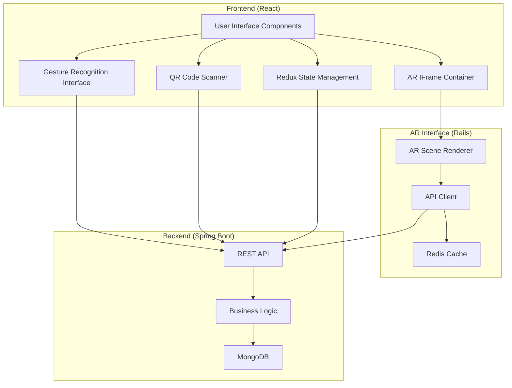

# QRoomController Project Architecture

## Overview

The QRoomController is a comprehensive system designed for controlling smart devices through gesture recognition, with QR code scanning for device identification. The project has two main interfaces:

1. **Gesture Recognition (GR) Interface**: Implemented in React, communicates directly with the Spring Boot backend
2. **Augmented Reality (AR) Interface**: Implemented in Rails, embedded in the React app via an iframe

The system architecture consists of:

1. **Frontend (React)**: Main user interface and gesture recognition
2. **AR Interface (Rails)**: Serves the AR interface via an iframe in the React app
3. **Backend (Spring Boot)**: Data persistence and business logic

## System Architecture Diagram

## Component Details

### Frontend (React)

The React frontend is organized in a layered architecture:

- **First Layer**: Application layout and main components
- **Second Layer**: Navigation and selection pages
- **Third Layer**: Device interaction components (including Iframe.jsx for AR)
- **Fourth Layer**: Widget and gesture components
- **Fifth Layer**: UI feedback components

Key components:
- **Camera.jsx**: Handles QR code scanning for device identification
- **Iframe.jsx**: Embeds the Rails AR interface within the React app
- **Authentication**: Login and registration components
- **Redux Store**: Manages application state

### AR Interface (Rails)

The Rails application serves the AR interface that's embedded in the React app via an iframe:

- **SessionsController**: Handles user authentication and session management
- **DevicesController**: Manages device operations
- **ScenesController**: Handles AR scene rendering and QR code interactions
- **RedisDeviceCacheService**: Caches device data and tokens for improved performance
- **QroomControllerService**: Communicates with the Spring Boot backend

### Backend (Spring Boot)

The Spring Boot backend handles data persistence and business logic:

- **MongoDB**: Stores device and user data
- **REST API**: Provides endpoints for device management
- **Authentication**: JWT-based authentication

## Authentication Flow

1. User logs in through the React frontend
2. Credentials are sent directly to the Spring Boot backend
3. JWT token is returned and stored in the React app's Redux store
4. When using the AR interface, the token is passed to the Rails app via the iframe URL and postMessage API
5. Token is used for subsequent API requests from both interfaces

## Device Control Flow

### Gesture Recognition Interface
1. User scans a device QR code using the Camera component
2. Device ID is sent directly to the Spring Boot backend
3. User performs gestures to control the device
4. Gesture commands are sent directly to the Spring Boot backend
5. Backend updates device state in MongoDB

### AR Interface
1. User accesses the AR interface via the iframe
2. Rails app receives the token from the React app
3. Rails app communicates with the Spring Boot backend to get device data
4. User interacts with AR markers to control devices
5. Commands are sent from the Rails app to the Spring Boot backend
6. Backend updates device state in MongoDB

## Data Caching Strategy

The system uses Redis for caching in the Rails AR interface:
- Authentication tokens
- Device data
- Scene markers
- Performance metrics

This reduces load on the backend and improves response times for the AR interface.

## Deployment

The system is containerized using Docker:
- Frontend: Node.js container running Vite
- AR Interface: Ruby on Rails container
- Backend: Spring Boot container
- Database: MongoDB container
- Cache: Redis container

## Technologies Used

- **Frontend**: React, Redux, TailwindCSS, MediaPipe (for gesture recognition)
- **AR Interface**: Ruby on Rails, Redis
- **Backend**: Spring Boot, MongoDB
- **DevOps**: Docker, Docker Compose
